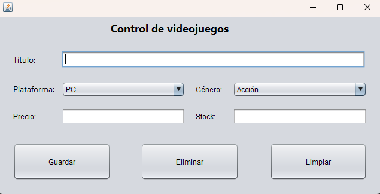

# Sistema de Gestión de Inventario de Videojuegos

## Descripción

Este proyecto es un sistema de gestión de inventario de videojuegos desarrollado en Java, utilizando MySQL como base de datos. Permite agregar, listar, buscar, actualizar y eliminar registros de videojuegos en el inventario.

## Funcionalidades

- **Agregar Videojuegos:** Permite ingresar nuevos videojuegos al inventario.
- **Listar Videojuegos:** Muestra una lista de todos los videojuegos disponibles.
- **Buscar Videojuegos:** Permite buscar videojuegos por Título o Plataforma.
- **Actualizar Videojuego:** Permite actualizar la información de un videojuego existente.
- **Eliminar Videojuego:** Permite eliminar un videojuego del inventario.

## Requisitos

- Java JDK 8 o superior
- MySQL 5.7 o superior
- MySQL Connector/J (si se usa Maven, la dependencia se agrega automáticamente)

## Guía de Desarrollo (Paso a Paso)

1. **Crear la Base de Datos:**

    - Se deberá crear la base de datos en MySQL, utilizando el siguiente script:

    ```sql
    -- Crear la base de datos 'inventario_videojuegos'
    CREATE DATABASE db_inventario_videojuegos;

    -- Utilizar la base de datos 'inventario_videojuegos'
    USE db_inventario_videojuegos;

    -- Crear la tabla 'videojuegos'
    CREATE TABLE videojuegos (
        id INT AUTO_INCREMENT PRIMARY KEY,  -- Auto incremental y clave primaria
        titulo VARCHAR(255) NOT NULL,       -- VARCHAR con un máximo de 255 caracteres, no puede ser nula
        plataforma VARCHAR(255) NOT NULL,   -- VARCHAR con un máximo de 255 caracteres, no puede ser nula
        genero VARCHAR(255) NOT NULL,       -- VARCHAR con un máximo de 255 caracteres, no puede ser nula
        precio DECIMAL(10, 2) NOT NULL,     -- DECIMAL con un total de 10 dígitos y 2 decimales, no puede ser nula
        stock INT NOT NULL                 -- Entero, no puede ser nula        
    );
    ```

2. **Creación y Configuración del Proyecto:**

    - Ahora se deberá crear el proyecto utilizando el **IDE Netbeans** y seleccionado la categoría **Java with MAVEN** y la plantilla de proyecto **Java Application** a como se muestra imagen:

    

    - En la siguiente ventana se colocara el nombre del proyecto, el *group id* puede dejarse a como esta por defecto y la *version* se establecerá en 1.0

    

    - Posteriormente se deberá agregar 3 paquetes al proyecto, los cuales serán: **views**, **Models** y **Controllers**, se ilustra como se creara uno de ellos y los para los demás se deberá de repetir los pasos:
  
      - Clic derecho sobre la carpeta *Source Packages* -> **NEW** -> **Java Package**:
     

      - En la ventana que se despliega se colocara el nombre del paquete:
        

      - Luego de crear los otros dos paquete el proyecto dentra la siguiente estructura:
        

    - Ahora se deberá agregar la dependencia del driver de MySQL en el archivo **pom.xml**, para ello se deberá agregar el siguiente código dentro de este archivo:

    ```xml
    <dependencies>
        <dependency>
            <groupId>com.mysql</groupId>
            <artifactId>mysql-connector-j</artifactId>
            <version>8.4.0</version>
        </dependency>
    </dependencies>
    ```

    Esto justo después de la etiqueta ```</properties>``` y antes de la etiqueta ```</project>```

    Ejemplo de la estructura del final del archivo **pom.xml**:

    

3. Crear la clase encargada de la conexión:
   - Ahora se deberá crear una clase nueva en el paquete de **Models** con el nombre **ConnectionMySQL** y en ella se definirá el siguiente código:
  
    ```java
    package Models;

    import java.sql.*;

    /**
    *
    * @author seth
    */
    public class ConnectionMySQL {

        // Nombre del controlador JDBC de MySQL
        private static String JDBC_DRIVER = "com.mysql.cj.jdbc.Driver";
        // Nombre de la base de datos
        private static String JDBC_DB = "db_inventario_videojuegos";
        // URL de conexión a la base de datos
        private static String JDBC_URL = "jdbc:mysql://localhost:3306/" + JDBC_DB
            + "?useUnicode=true&useJDBCCompliantTimezoneShift=true"
            + "&useLegacyDatetimeCode=false&serverTimezone=UTC&useSSL=false"
            + "&allowPublicKeyRetrieval=true";
        // Usuario de la base de datos
        private static String JDBC_USER = "root";
        // Contraseña de la base de datos
        private static String JDBC_PASS = "1234";
        // Instancia del controlador JDBC
        private static Driver driver = null;

        /**
        * Método sincronizado para obtener una conexión a la base de datos.
        *
        * @return Connection - la conexión a la base de datos.
        * @throws SQLException - si ocurre un error al establecer la conexión.
        */
        public static synchronized Connection getConnection() throws SQLException {
            try {
                // Cargar la clase del controlador JDBC
                Class jdbcDriverClass = Class.forName(JDBC_DRIVER);
                // Crear una nueva instancia del controlador
                driver = (Driver) jdbcDriverClass.getDeclaredConstructor().newInstance();
                // Registrar el controlador con DriverManager
                DriverManager.registerDriver(driver);
            } catch (Exception e) {
                e.printStackTrace();
                throw new SQLException("Error al registrar el driver de MySQL");
            }
            // Retornar la conexión utilizando DriverManager
            return DriverManager.getConnection(JDBC_URL, JDBC_USER, JDBC_PASS);
        }

        /**
        * Método para cerrar un ResultSet.
        *
        * @param rs - el ResultSet a cerrar.
        */
        public static void close(ResultSet rs) {
            try {
                if (rs != null) {
                    rs.close();
                }
            } catch (SQLException e) {
                e.printStackTrace();
            }
        }

        /**
        * Método para cerrar un PreparedStatement.
        *
        * @param stmt - el PreparedStatement a cerrar.
        */
        public static void close(PreparedStatement stmt) {
            try {
                if (stmt != null) {
                    stmt.close();
                }
            } catch (SQLException e) {
                e.printStackTrace();
            }
        }

        /**
        * Método para cerrar una conexión a la base de datos.
        *
        * @param conn - la conexión a cerrar.
        */
        public static void close(Connection conn) {
            try {
                if (conn != null) {
                    conn.close();
                }
            } catch (SQLException e) {
                e.printStackTrace();
            }
        }

    }
    ```

4. A continuación se creara la clase del modelo de datos que funcionara con representación de la tabla de la base de datos, de igual manera se deberá crear en el paquete **Models** y llevara por nombre **Videojuegos** y se deberá crear el siguiente código:

    ```java
    package Models;

    /**
    * Clase que representa un videojuego con sus atributos y métodos asociados.
    * 
    * @autor seth
    */
    public class Videojuegos {
        
        // Atributos privados de la clase
        private int id;                // Identificador único del videojuego
        private String titulo;         // Título del videojuego
        private String plataforma;     // Plataforma en la que se puede jugar el videojuego (ej. PC, PS5)
        private String genero;         // Género del videojuego (ej. Aventura, Acción)
        private double precio;         // Precio del videojuego
        private int stock;             // Cantidad de unidades disponibles en stock
      
        /**
        * Constructor que inicializa un objeto Videojuegos con los atributos dados.
        *
        * @param titulo Título del videojuego
        * @param plataforma Plataforma del videojuego
        * @param genero Género del videojuego
        * @param precio Precio del videojuego
        * @param stock Cantidad de unidades disponibles
        */
        public Videojuegos(String titulo, String plataforma, String genero, double precio, int stock) {
            this.titulo = titulo;
            this.plataforma = plataforma;
            this.genero = genero;
            this.precio = precio;
            this.stock = stock;
          
        }

        /**
        * Constructor que inicializa un objeto Videojuegos con todos los atributos, incluido el ID.
        *
        * @param id Identificador único del videojuego
        * @param titulo Título del videojuego
        * @param plataforma Plataforma del videojuego
        * @param genero Género del videojuego
        * @param precio Precio del videojuego
        * @param stock Cantidad de unidades disponibles
        */
        public Videojuegos(int id, String titulo, String plataforma, String genero, double precio, int stock) {
            this.id = id;
            this.titulo = titulo;
            this.plataforma = plataforma;
            this.genero = genero;
            this.precio = precio;
            this.stock = stock;
        }

        // Métodos getter y setter para acceder y modificar los atributos privados

        /**
        * Obtiene el ID del videojuego.
        *
        * @return ID del videojuego
        */
        public int getId() {
            return id;
        }

        /**
        * Obtiene el título del videojuego.
        *
        * @return Título del videojuego
        */
        public String getTitulo() {
            return titulo;
        }

        /**
        * Establece el título del videojuego.
        *
        * @param titulo Nuevo título del videojuego
        */
        public void setTitulo(String titulo) {
            this.titulo = titulo;
        }

        /**
        * Obtiene la plataforma del videojuego.
        *
        * @return Plataforma del videojuego
        */
        public String getPlataforma() {
            return plataforma;
        }

        /**
        * Establece la plataforma del videojuego.
        *
        * @param plataforma Nueva plataforma del videojuego
        */
        public void setPlataforma(String plataforma) {
            this.plataforma = plataforma;
        }

        /**
        * Obtiene el género del videojuego.
        *
        * @return Género del videojuego
        */
        public String getGenero() {
            return genero;
        }

        /**
        * Establece el género del videojuego.
        *
        * @param genero Nuevo género del videojuego
        */
        public void setGenero(String genero) {
            this.genero = genero;
        }

        /**
        * Obtiene el precio del videojuego.
        *
        * @return Precio del videojuego
        */
        public double getPrecio() {
            return precio;
        }

        /**
        * Establece el precio del videojuego.
        *
        * @param precio Nuevo precio del videojuego
        */
        public void setPrecio(double precio) {
            this.precio = precio;
        }

        /**
        * Obtiene la cantidad de unidades disponibles del videojuego.
        *
        * @return Cantidad de unidades disponibles
        */
        public int getStock() {
            return stock;
        }

        /**
        * Establece la cantidad de unidades disponibles del videojuego.
        *
        * @param stock Nueva cantidad de unidades disponibles
        */
        public void setStock(int stock) {
            this.stock = stock;
        }

    }


    ```

5. Ahora se creara la clase **VideojuegoDAO** la cual se encargar de manejar las operaciones de la base de datos a nivel de la aplicación para la entidad Videojuegos, esta clase también se deberá de crear en el paquete **Models** y el código sera el siguiente:

    ```java
    package Models;

    import java.sql.*;
    import java.util.ArrayList;
    import java.util.List;

    /**
    * Clase que maneja las operaciones de base de datos para la entidad
    * Videojuegos.
    *
    * @autor seth
    */
    public class VideojuegosDAO {

        // Consultas SQL utilizadas en la clase
        private final String SQL_INSERT = "INSERT INTO videojuegos (titulo, plataforma, genero, precio, stock) VALUES (?, ?, ?, ?, ?)";
        private final String SQL_UPDATE = "UPDATE videojuegos SET titulo = ?, plataforma = ?, genero = ?, precio = ?, stock = ? WHERE id = ?";
        private final String SQL_DELETE = "DELETE FROM videojuegos WHERE id = ?";
        private final String SQL_SELECT = "SELECT * FROM videojuegos";
        private final String SQL_SELECTBUSQUEDAID = "SELECT * FROM videojuegos WHERE id = ?";
        private final String SQL_SELECTBUSQUEDANOMBRE = "SELECT * FROM videojuegos WHERE titulo = ?";

        /**
        * Método para insertar un nuevo videojuego en la base de datos.
        *
        * @param videojuego El objeto Videojuegos a insertar
        * @throws SQLException Si ocurre un error al insertar el videojuego
        */
        public void insertarVideojuego(Videojuegos videojuego) throws SQLException {
            Connection conn = null; // Declaramos la conexión
            PreparedStatement stmt = null; // Declaramos el PreparedStatement

            try {
                conn = ConnectionMySQL.getConnection(); // Obtenemos la conexión desde ConnectionMySQL
                stmt = conn.prepareStatement(SQL_INSERT); // Preparamos la consulta SQL para insertar
                // Asignamos los valores a los parámetros de la consulta SQL
                stmt.setString(1, videojuego.getTitulo());
                stmt.setString(2, videojuego.getPlataforma());
                stmt.setString(3, videojuego.getGenero());
                stmt.setDouble(4, videojuego.getPrecio());
                stmt.setInt(5, videojuego.getStock());
                stmt.executeUpdate(); // Ejecutamos la consulta de inserción
            } finally {
                ConnectionMySQL.close(stmt); // Cerramos el PreparedStatement
                ConnectionMySQL.close(conn); // Cerramos la conexión
            }
        }

        /**
        * Método para actualizar un videojuego existente en la base de datos.
        *
        * @param videojuego El objeto Videojuegos a actualizar
        * @throws SQLException Si ocurre un error al actualizar el videojuego
        */
        public void actualizarVideojuego(Videojuegos videojuego) throws SQLException {
            Connection conn = null; // Declaramos la conexión
            PreparedStatement stmt = null; // Declaramos el PreparedStatement

            try {
                conn = ConnectionMySQL.getConnection(); // Obtenemos la conexión desde ConnectionMySQL
                stmt = conn.prepareStatement(SQL_UPDATE); // Preparamos la consulta SQL para actualizar
                // Asignamos los valores a los parámetros de la consulta SQL
                stmt.setString(1, videojuego.getTitulo());
                stmt.setString(2, videojuego.getPlataforma());
                stmt.setString(3, videojuego.getGenero());
                stmt.setDouble(4, videojuego.getPrecio());
                stmt.setInt(5, videojuego.getStock());
                stmt.setInt(6, videojuego.getId());
                stmt.executeUpdate(); // Ejecutamos la consulta de actualización
            } finally {
                ConnectionMySQL.close(stmt); // Cerramos el PreparedStatement
                ConnectionMySQL.close(conn); // Cerramos la conexión
            }
        }

        /**
        * Método para eliminar un videojuego de la base de datos.
        *
        * @param id El ID del videojuego a eliminar
        * @throws SQLException Si ocurre un error al eliminar el videojuego
        */
        public void eliminarVideojuego(int id) throws SQLException {
            Connection conn = null; // Declaramos la conexión
            PreparedStatement stmt = null; // Declaramos el PreparedStatement

            try {
                conn = ConnectionMySQL.getConnection(); // Obtenemos la conexión desde ConnectionMySQL
                stmt = conn.prepareStatement(SQL_DELETE); // Preparamos la consulta SQL para eliminar
                stmt.setInt(1, id); // Asignamos el valor del ID al parámetro de la consulta SQL
                stmt.executeUpdate(); // Ejecutamos la consulta de eliminación
            } finally {
                ConnectionMySQL.close(stmt); // Cerramos el PreparedStatement
                ConnectionMySQL.close(conn); // Cerramos la conexión
            }
        }

        /**
        * Método para obtener un videojuego por su ID.
        *
        * @param id El ID del videojuego a obtener
        * @return El objeto Videojuegos correspondiente al ID
        * @throws SQLException Si ocurre un error al obtener el videojuego
        */
        public Videojuegos obtenerVideojuegoPorId(int id) throws SQLException {
            Videojuegos videojuego = null; // Declaramos el objeto Videojuegos

            Connection conn = null; // Declaramos la conexión
            PreparedStatement stmt = null; // Declaramos el PreparedStatement
            ResultSet rs = null; // Declaramos el ResultSet para obtener los resultados de la consulta

            try {
                conn = ConnectionMySQL.getConnection(); // Obtenemos la conexión desde ConnectionMySQL
                stmt = conn.prepareStatement(SQL_SELECTBUSQUEDAID); // Preparamos la consulta SQL para seleccionar por id
                stmt.setInt(1, id); // Asignamos el valor del ID al parámetro de la consulta SQL
                rs = stmt.executeQuery(); // Ejecutamos la consulta de selección

                // Si se encuentra un resultado, creamos un nuevo objeto Videojuegos con los datos obtenidos
                if (rs.next()) {
                    videojuego = new Videojuegos(
                            rs.getInt("id"),
                            rs.getString("titulo"),
                            rs.getString("plataforma"),
                            rs.getString("genero"),
                            rs.getDouble("precio"),
                            rs.getInt("stock")
                    );
                }
            } finally {
                ConnectionMySQL.close(rs); // Cerramos el ResultSet
                ConnectionMySQL.close(stmt); // Cerramos el PreparedStatement
                ConnectionMySQL.close(conn); // Cerramos la conexión
            }
            return videojuego; // Retornamos el objeto Videojuegos
        }

        /**
        * Método para obtener un videojuego por su ID.
        *
        * @param nombre El nombre del videojuego a obtener
        * @return El la lista de Videojuegos correspondiente al nombre
        * @throws SQLException Si ocurre un error al obtener el videojuego
        */
        public List<Videojuegos> buscarVideojuegosPorTitulo(String titulo) throws SQLException {
            List<Videojuegos> listaVideojuegos = new ArrayList<>();
            Connection conn = null;
            PreparedStatement stmt = null;
            ResultSet rs = null;

            try {
                conn = ConnectionMySQL.getConnection();
                stmt = conn.prepareStatement(SQL_SELECTBUSQUEDANOMBRE);
                stmt.setString(1, titulo);
                rs = stmt.executeQuery();

                while (rs.next()) {
                    Videojuegos videojuego = new Videojuegos(
                            rs.getInt("id"),
                            rs.getString("titulo"),
                            rs.getString("plataforma"),
                            rs.getString("genero"),
                            rs.getDouble("precio"),
                            rs.getInt("stock")
                    );
                    listaVideojuegos.add(videojuego);
                }
            } finally {
                ConnectionMySQL.close(rs);
                ConnectionMySQL.close(stmt);
                ConnectionMySQL.close(conn);
            }
            return listaVideojuegos;
        }

        /**
        * Método para obtener todos los videojuegos de la base de datos.
        *
        * @return Lista de objetos Videojuegos
        * @throws SQLException Si ocurre un error al obtener los videojuegos
        */
        public List<Videojuegos> obtenerTodosLosVideojuegos() throws SQLException {
            List<Videojuegos> listaVideojuegos = new ArrayList<>(); // Creamos una lista para almacenar los videojuegos

            Connection conn = null; // Declaramos la conexión
            PreparedStatement stmt = null; // Declaramos el PreparedStatement
            ResultSet rs = null; // Declaramos el ResultSet para obtener los resultados de la consulta

            try {
                conn = ConnectionMySQL.getConnection(); // Obtenemos la conexión desde ConnectionMySQL
                stmt = conn.prepareStatement(SQL_SELECT); // Preparamos la consulta SQL para seleccionar todos los videojuegos
                rs = stmt.executeQuery(); // Ejecutamos la consulta de selección

                // Recorremos los resultados obtenidos y los añadimos a la lista de videojuegos
                while (rs.next()) {
                    Videojuegos videojuego = new Videojuegos(
                            rs.getInt("id"),
                            rs.getString("titulo"),
                            rs.getString("plataforma"),
                            rs.getString("genero"),
                            rs.getDouble("precio"),
                            rs.getInt("stock")
                    );
                    listaVideojuegos.add(videojuego);
                }
            } finally {
                ConnectionMySQL.close(rs); // Cerramos el ResultSet
                ConnectionMySQL.close(stmt); // Cerramos el PreparedStatement
                ConnectionMySQL.close(conn); // Cerramos la conexión
            }
            return listaVideojuegos; // Retornamos la lista de videojuegos
        }
    }

    ```

    [!Note]
    > ¿Qué es DAO (Data Access Object)?
    > El patrón DAO es un patrón de diseño utilizado en la programación orientada a objetos para separar la lógica de acceso a datos de la lógica de negocio. Este patrón proporciona una abstracción que permite acceder a la base de datos u otras fuentes de datos de una manera independiente de la tecnología de persistencia utilizada.

6. Ahora se deberá crear la GUI (Graphical User Interface), para ellos se necesitara crear dos **JFrame Form** en el paquete **Views**, estos se detallan a continuación:
   - Formulario (JFrame Form) para el control de los videojuegos, en este formulario se podrán agregar nuevos videojuegos y se podrán modificar los videojuegos existentes, a esta ventana la llamaremos **frmControlVideoJuego** y su diseño se puede ver en la siguiente imagen:
     - Diseño del frmControlVideoJuego:
     

     - Desglose de controles utilizados

<table>

<thead>
    <tr>
        <th>Control</th>
        <th>Propiedad </th>
        <th>Valor</th>
    </tr>
</thead>
  <tbody>
  <tr>
  <td>JFrame</td>
    <td>defaultCloseOperation</td>
    <td>DISPOSE</td>
  </tr>
  <tr>
    <td>jLabel</td>
    <td>text</td>
    <td>Control de videojuegos</td>
  </tr>
  <tr>
    <td>JPanel</td>
    <td>border → titled border → title</td>
    <td>Imagen</td>
  </tr>
  <tr>
    <td>JLabel</td>
    <td>text</td>
    <td>Título:</td>
  </tr>
  <tr>
    <td rowspan=2>Text Field</td>
    <td>text</td>
    <td>"  " → Vació</td>
  </tr>
  <tr>
    <td>Variable Name</td>
    <td>txtTitulo</td>
  </tr>

  <tr>
    <td>JLabel</td>
    <td>text</td>
    <td>Plataforma:</td>
  </tr>
  <tr>
    <td rowspan=2>jComboBox</td>
    <td>Variable Name</td>
    <td>cmbPlataforma</td>
  </tr>
  <tr>
    <td>Model</td>
    <td>Se coloca la lista plataformas:
    PC
    PlayStation 5 (PS5)
    PlayStation 4 (PS4)
    PlayStation 3 (PS3)
    Xbox Series X/S
    Xbox One
    Xbox 360
    Nintendo Switch
    Nintendo Wii U
    Nintendo Wii
    Nintendo 3DS
    Nintendo DS</td>
  </tr>
 
 <tr>
    <td>JLabel</td>
    <td>text</td>
    <td>Género:</td>
  </tr>
  <tr>
    <td rowspan=2>jComboBox</td>
    <td>Variable Name</td>
    <td>cmbGenero</td>
  </tr>
  <tr>
    <td>Model</td>
    <td>Se coloca la lista géneros:
    Acción
    Aventura
    RPG (Role-Playing Game)
    Simulación
    Estrategia
    Deportes
    Carreras
    Lucha
    Shooter
    Puzzle
    Música/Ritmo
    Plataforma
    Horror
    Metroidvania
    Sandbox
    Battle Royale
    MOBA (Multiplayer Online Battle Arena)
    Roguelike
    Stealth
    Survival</td>
  </tr>

 <tr>
    <td>JLabel</td>
    <td>text</td>
    <td>Precio:</td>
  </tr>
  <tr>
    <td rowspan=2>Text Field</td>
    <td>text</td>
    <td>"  " → Vació</td>
  </tr>
  <tr>
    <td>Variable Name</td>
    <td>txtPrecio</td>
  </tr>

 <tr>
    <td>JLabel</td>
    <td>text</td>
    <td>Stock:</td>
  </tr>
  <tr>
    <td rowspan=2>Text Field</td>
    <td>text</td>
    <td>"  " → Vació</td>
  </tr>
  <tr>
    <td>Variable Name</td>
    <td>txtStock</td>
  </tr>


 <tr>
    <td rowspan=2>Button</td>
    <td>text</td>
    <td>Guardar</td>
  </tr>
  <tr>
    <td>Variable Name</td>
    <td>btnGuardar</td>
  </tr>

 <tr>
    <td rowspan=2>Button</td>
    <td>text</td>
    <td>Eliminar</td>
  </tr>
  <tr>
    <td>Variable Name</td>
    <td>btnEliminar</td>
  </tr>
   <tr>
    <td rowspan=2>Button</td>
    <td>text</td>
    <td>Limpiar</td>
  </tr>
  <tr>
    <td>Variable Name</td>
    <td>btnLimpiar</td>
  </tr>
</table>

Ahora se creara los eventos de cada botón y su funcionalidad

- Primero se deberá crear una variable a nivel de clase
  
```java
 private int idVideojuego = -1;
```

- Luego se deberá agregar un constructor más, a como se muestra en el código:

```java
public frmControlVideoJuego(Videojuegos videojuego) {
        initComponents();

        // Cargar los datos del videojuego en el formulario
        this.idVideojuego = videojuego.getId();
        txtTitulo.setText(videojuego.getTitulo());
        cmbPlataforma.setSelectedItem(videojuego.getPlataforma());
        cmbGenero.setSelectedItem(videojuego.getGenero());
        txtPrecio.setText(String.valueOf(videojuego.getPrecio()));
        txtStock.setText(String.valueOf(videojuego.getStock()));
    }
```

- Ahora los siguientes eventos:
  
```java
    private void btnGuardarActionPerformed(java.awt.event.ActionEvent evt) {                                           
        try {
            VideojuegosDAO dao = new VideojuegosDAO();

            // Verificar si se trata de una actualización o un nuevo registro
            if (idVideojuego == -1) {
                // Nuevo videojuego
                Videojuegos videojuego = new Videojuegos(
                        txtTitulo.getText(),
                        (String) cmbPlataforma.getSelectedItem(),
                        (String) cmbGenero.getSelectedItem(),
                        Double.parseDouble(txtPrecio.getText()),
                        Integer.parseInt(txtStock.getText())
                );
                dao.insertarVideojuego(videojuego);
                JOptionPane.showMessageDialog(null, "Videojuego registrado con éxito");
            } else {
                // Actualizar videojuego existente
                Videojuegos videojuego = new Videojuegos(
                        idVideojuego, // Pasar el ID para la actualización
                        txtTitulo.getText(),
                        (String) cmbPlataforma.getSelectedItem(),
                        (String) cmbGenero.getSelectedItem(),
                        Double.parseDouble(txtPrecio.getText()),
                        Integer.parseInt(txtStock.getText())
                );
                dao.actualizarVideojuego(videojuego);
                JOptionPane.showMessageDialog(null, "Videojuego actualizado con éxito");
                
            }

        } catch (SQLException e) {
            e.printStackTrace();
            JOptionPane.showMessageDialog(null, "Error al guardar el videojuego");
        }
    }                                          

    private void btnEliminarActionPerformed(java.awt.event.ActionEvent evt) {                                            
        // Verificar si se trata de una eliminación 
          VideojuegosDAO dao = new VideojuegosDAO();
            if (idVideojuego != -1) {
              try {
                  dao.eliminarVideojuego(idVideojuego);
              } catch (SQLException ex) {
                  ex.printStackTrace();
              }
                JOptionPane.showMessageDialog(null, "Videojuego eliminado con éxito");
              
            } 
    }                                           

```

**Crear el segundo JFrame Form:**

   - Formulario (JFrame Form) para listar y buscar videojuegos. A esta ventana la llamaremos frmListaVideojuegos y su diseño se puede ver en la siguiente imagen:
     - Diseño del frmListaVideojuegos:

    

    - Desglose de controles utilizados:

<table>
        <thead>
            <tr>
                <th>Control</th>
                <th>Propiedad</th>
                <th>Valor</th>
            </tr>
        </thead>
        <tbody>
          <tr>
            <td>JFrame</td>
            <td>defaultCloseOperation</td>
            <td>EXIT_ON_CLOSE</td>
          </tr>
          <tr>
            <td>JLabel</td>
            <td>text</td>
            <td>Lista de Videojuegos</td>
          </tr>
          <tr>
            <td>JTable</td>
            <td>Variable Name</td>
            <td>tblVideojuegos</td>
          </tr>
          <tr>
            <td>JTextField</td>
            <td>Variable Name</td>
            <td>txtBuscar</td>
          </tr>
          <tr>
            <td>JButton</td>
            <td>text</td>
            <td>Buscar</td>
          </tr>
          <tr>
            <td>JButton</td>
            <td>Variable Name</td>
            <td>btnBuscar</td>
          </tr>
          <tr>
            <td>JButton</td>
            <td>text</td>
            <td>Actualizar Datos</td>
          </tr>
          <tr>
            <td>JButton</td>
            <td>Variable Name</td>
            <td>btnActualizar</td>
          </tr>
           <tr>
            <td>JButton</td>
            <td>text</td>
            <td>Modificar Datos VideoJuego</td>
          </tr>
          <tr>
            <td>JButton</td>
            <td>Variable Name</td>
            <td>btnModificarVideoJuego</td>
          </tr>
          <tr>
            <td>JButton</td>
            <td>text</td>
            <td>Agregar</td>
          </tr>
          <tr>
            <td>JButton</td>
            <td>Variable Name</td>
            <td>btnAgregar</td>
          </tr>
        </tbody>
</table>
Ahora se creara los eventos de cada botón y su funcionalidad

- Primero se deberá crear una variable a nivel de clase
  
```java
  private VideojuegosDAO videojuegosDAO = new VideojuegosDAO();
```

- Luego se deberá modificar el constructor

```java
  public frmListaVideojuegos() {
        initComponents();
        cargarTabla();
    }
```

- Ahora los siguientes eventos:
  
```java
   private void cargarTabla() {
        try {
            // Obtener la lista de videojuegos desde la base de datos
            List<Videojuegos> listaVideojuegos = videojuegosDAO.obtenerTodosLosVideojuegos();

            // Definir el modelo de la tabla con las columnas correspondientes
            DefaultTableModel modelo = new DefaultTableModel(
                    new Object[][]{},
                    new String[]{"ID", "Título", "Plataforma", "Género", "Precio", "Stock"}
            );

            // Limpiar cualquier dato previo en la tabla
            modelo.setRowCount(0);

            // Agregar los datos de los videojuegos al modelo
            for (Videojuegos videojuego : listaVideojuegos) {
                modelo.addRow(new Object[]{
                    videojuego.getId(),
                    videojuego.getTitulo(),
                    videojuego.getPlataforma(),
                    videojuego.getGenero(),
                    videojuego.getPrecio(),
                    videojuego.getStock()
                });
            }

            // Asignar el modelo actualizado a la tabla
            tblVideojuegos.setModel(modelo);

        } catch (SQLException e) {
            e.printStackTrace();
            JOptionPane.showMessageDialog(null, "Error al cargar los datos de los videojuegos");
        }
    }
    private void btnBuscarActionPerformed(java.awt.event.ActionEvent evt) {                                          

        String titulo = txtBuscar.getText();
        try {
            // Buscar los videojuegos que coinciden con el título
            List<Videojuegos> listaVideojuegos = videojuegosDAO.buscarVideojuegosPorTitulo(titulo);

            // Definir el modelo de la tabla con las columnas correspondientes
            DefaultTableModel modelo = new DefaultTableModel(
                    new Object[][]{},
                    new String[]{"ID", "Título", "Plataforma", "Género", "Precio", "Stock"}
            );

            // Limpiar cualquier dato previo en la tabla
            modelo.setRowCount(0);

            // Agregar los datos de los videojuegos encontrados al modelo
            for (Videojuegos videojuego : listaVideojuegos) {
                modelo.addRow(new Object[]{
                    videojuego.getId(),
                    videojuego.getTitulo(),
                    videojuego.getPlataforma(),
                    videojuego.getGenero(),
                    videojuego.getPrecio(),
                    videojuego.getStock()
                });
            }

            // Asignar el modelo actualizado a la tabla
            tblVideojuegos.setModel(modelo);

        } catch (SQLException e) {
            e.printStackTrace();
            JOptionPane.showMessageDialog(this, "Error al buscar los datos de los videojuegos");
        }
    }                                         

    private void btnModificarVideoJuegoActionPerformed(java.awt.event.ActionEvent evt) {                                                       
        int filaSeleccionada = tblVideojuegos.getSelectedRow();

        if (filaSeleccionada == -1) {
            JOptionPane.showMessageDialog(this, "Seleccione un videojuego de la tabla.");
        } else {
            // Obtener los datos del videojuego seleccionado de la tabla
            int id = (int) tblVideojuegos.getValueAt(filaSeleccionada, 0);
            String titulo = (String) tblVideojuegos.getValueAt(filaSeleccionada, 1);
            String plataforma = (String) tblVideojuegos.getValueAt(filaSeleccionada, 2);
            String genero = (String) tblVideojuegos.getValueAt(filaSeleccionada, 3);
            double precio = (double) tblVideojuegos.getValueAt(filaSeleccionada, 4);
            int stock = (int) tblVideojuegos.getValueAt(filaSeleccionada, 5);

            // Crear un objeto Videojuegos con los datos seleccionados
            Videojuegos videojuegoSeleccionado = new Videojuegos(id, titulo, plataforma, genero, precio, stock);

            // Abrir el formulario frmControlVideoJuego con el videojuego seleccionado
            frmControlVideoJuego controlVideojuegoForm = new frmControlVideoJuego(videojuegoSeleccionado);
            controlVideojuegoForm.setVisible(true);
        }
    }                                                      

    private void btnAgregarActionPerformed(java.awt.event.ActionEvent evt) {                                           
        // Abrir el formulario frmControlVideoJuego con el videojuego seleccionado
        frmControlVideoJuego controlVideojuegoForm = new frmControlVideoJuego();
        controlVideojuegoForm.setVisible(true);
    }                                          

    private void btnActualizarActionPerformed(java.awt.event.ActionEvent evt) {                                              
        cargarTabla();
    }                                             

```
## Licencia

Este proyecto está licenciado bajo la Licencia MIT. Consulta el archivo [LICENSE](LICENSE) para más detalles.

## Contacto

- **Autor:** Jeremy Elizondo
- **Correo:**
- **GitHub:** [seth0992](https://github.com/seth0992)
